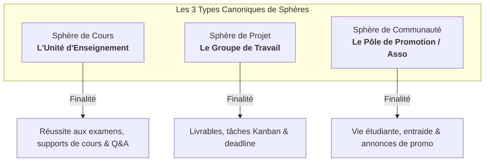
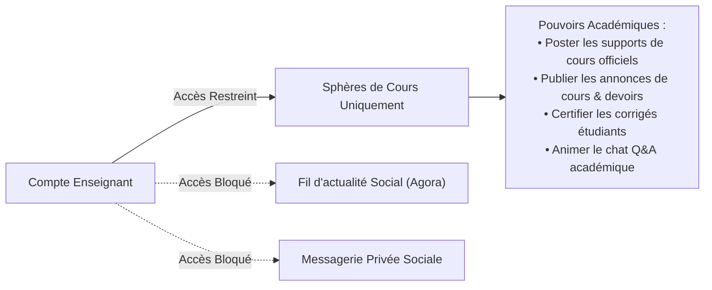
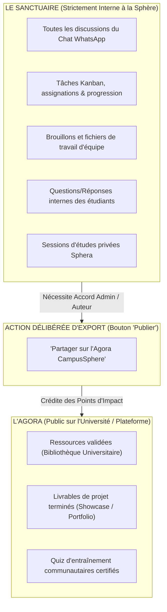

# POLITIQUE & CHARTE FONCTIONNELLE DES SPHÈRES (V1 CANONIQUE)
*CampusSphere Product Specification & Strategic Governance*

---

## 1. Philosophie Fondamentale : L'Agora vs Le Sanctuaire

Pour comprendre l'utilité des Sphères, il faut définir la séparation des pouvoirs dans CampusSphere :
- **L'Agora (L'App Globale)** : Le fil d'actualité public, les ressources partagées au niveau de l'université, la découverte de profils, le réseau social étudiant. C'est l'espace de la sérendipité, de la visibilité et du divertissement académique.
- **Le Sanctuaire (Les Sphères)** : Des micro-espaces clos, focalisés, opérationnels et sans distraction. On ne vient pas dans une sphère pour scroller sans but, on y vient pour **travailler, collaborer, réviser ou se coordonner**.

> **Règle d'or de l'expérience Sphère** : Chaque interaction dans une sphère doit répondre à un besoin d'action concret : *s'informer d'une consigne*, *télécharger un support*, *faire avancer un livrable*, *poser une question de cours*, *s'entraîner avec l'IA*.

---

## 2. La Triade Canonique : Les 3 Seuls Types de Sphères

CampusSphere unifie ses espaces autour de **3 modèles mentaux évidents** pour tout étudiant :

---

## 3. Les Vues d'Ensemble Dédiées (Overview Sur-Mesure)

Chaque type de sphère possède un tableau de bord d'accueil unique, calqué sur les priorités de son quotidien :

### 🎓 1. Overview Cours
- **Bannière d'alerte / Prochaine échéance** : Prochain contrôle continu, date d'examen ou TP à rendre.
- **Dernière annonce officielle** : Épinglée en haut (message de l'enseignant ou du délégué).
- **Ressources récentes** : Les derniers cours, TDs et corrigés déposés cette semaine.
- **Sphera Quick-Study** : Widget de révision rapide en 1 clic (*Générer un quiz de 5 questions sur le dernier cours*).
- **Contacts clés** : Enseignant(s) référent(s) et délégué(s) de cours avec badge de rôle.

### 🚀 2. Overview Projet
- **Indicateur de Progression global (%)** : Calculé automatiquement sur les tâches terminées du Kanban.
- **Compte à rebours du Livrable** : Jours restants avant la soutenance ou le rendu final.
- **Mes tâches assignées** : Ce que l'utilisateur connecté doit faire immédiatement.
- **Tâches en retard (Alertes rouges)** : Alertes visuelles pour débloquer l'équipe.
- **Derniers fichiers de travail** : Accès rapide aux brouillons de rapport et slides.

### 🌐 3. Overview Communauté
- **Prochain événement de promo / club** : Date, heure et lieu de la prochaine rencontre ou conférence.
- **Dernières actualités officielles** : Annonces du BDE, opportunités de stages, infos filière.
- **Fichiers indispensables** : Calendrier académique officiel, emploi du temps, chartes.
- **Bureau & Modération** : Présentation des responsables de l'association ou de la promotion.

---

## 4. Le Compte Enseignant : Un Espace Scellé et Professionnel

L'enseignant ne vient pas pour faire du réseau social étudiant. Son périmètre est **volontairement restreint** :

### Règles du Compte Enseignant :
1. **Périmètre d'action** : L'enseignant accède exclusivement à ses **Sphères de Cours** (et à terme aux ressources associées). Il n'a pas accès au fil public général, évitant tout mélange des genres avec la vie sociale des étudiants.
2. **Double mode pour les cours** :
   - **Sphère de cours AVEC enseignant** : L'enseignant pilote l'espace académique, valide les contenus et répond aux questions officielles.
   - **Sphère de cours SANS enseignant (Autonome)** : Sphère d'entraide entre pairs animée par le délégué de promotion ou un groupe d'étudiants majeurs.

---

## 5. Le Chat de Sphère : L'Expérience "WhatsApp" Intégrée

Les étudiants désertent les plateformes académiques car les messageries y sont souvent lentes et étouffées dans des boîtes de 200px. Le chat de chaque sphère reproduit les codes d'une conversation WhatsApp moderne :

### Caractéristiques de l'Expérience Chat :
- **Pleine hauteur & Clarté** : Le chat occupe un véritable onglet conversationnel fluide.
- **Bulles différenciées** :
  - Messages de l'utilisateur : alignés à droite, couleur accent.
  - Messages des camarades : alignés à gauche avec nom coloré et avatar.
  - Messages de l'Enseignant : surlignage d'or avec badge certifié *« Professeur »*.
- **Accusés de réception & Horodatage** : Horodatage précis et état d'envoi.
- **Réponses citées (Reply/Quote)** : Clic direct sur un message pour y répondre précisément.
- **Partage de médias & fichiers** : Dépôt direct d'images, PDFs et vocaux dans la discussion.
- **Temps réel WebSocket robuste** : Reconnexion automatique et synchronisation instantanée pour tous les membres de la sphère sans exception.

---

## 6. La Frontière Étanche : Ce qui reste Privé vs Ce qui devient Public

L'étudiant et l'enseignant doivent avoir une confiance absolue dans ce qui reste au sein de la sphère et ce qui rayonne à l'extérieur.

### Principes de Démarcation :
1. **Par défaut, TOUT est privé à la sphère** : Aucun message, aucune tâche, aucun fichier brouillon n'est indexé par la recherche globale ni visible hors des membres actifs de la sphère.
2. **L'Exportation Délibérée vers l'Agora** :
   - Un étudiant ayant déposé une fiche de synthèse ou des annales corrigées dans sa sphère peut cliquer sur : **« Publier dans la bibliothèque universitaire »**.
   - Cette action soumet la ressource au catalogue public et octroie à l'étudiant des **Points d'Impact**.
3. **Le Showcase de Projet** :
   - À la fin d'un projet, l'équipe peut voter pour publier son livrable final (rapport, vidéo de démo, présentation) sur leur profil ou dans l'Agora pour valoriser leur travail auprès des recruteurs et camarades.

---

## 7. Matrice des Onglets & Fonctionnalités par Type

| Onglet / Fonctionnalité | Sphère de Cours 🎓 | Sphère de Projet 🚀 | Sphère de Communauté 🌐 |
|---|:---:|:---:|:---:|
| **Vue d'ensemble** | ✅ Spécifique Cours | ✅ Spécifique Projet | ✅ Spécifique Communauté |
| **Annonces Officielles** | ✅ **Prioritaire** (Prof / Délégué) | ❌ Non (Chat d'équipe suffit) | ✅ **Oui** (Bureau / BDE) |
| **Kanban & Tâches** | ❌ Non | ✅ **Prioritaire** (Cœur du projet) | ❌ Non |
| **Fichiers Partagés** | ✅ Cours, TDs, Annales | ✅ Rapports, Présentations, Code | ✅ Archives, Calendriers, Guides |
| **Chat WhatsApp** | ✅ Q&A et Entraide | ✅ Discussion d'équipe synchrone | ✅ Discussion générale de promo |
| **Sphera IA** | ✅ Fiches, Quiz, Q&A RAG | ✅ Découpage en tâches, Relecture | 💡 Digest d'annonces |
| **Membres** | ✅ Étudiants + Badge Prof | ✅ Membres de l'équipe projet | ✅ Membres de promo / Club |
