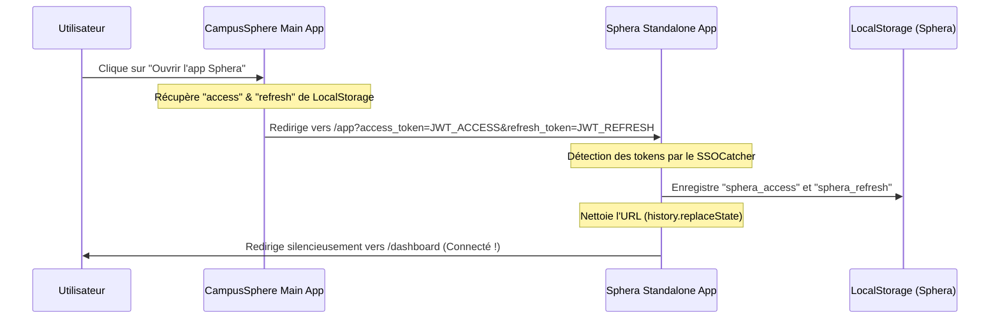

# 🌌 Documentation Technique - Sphera V2

Ce document présente l'architecture, le fonctionnement de l'intégration Single Sign-On (SSO), la structure du moteur de génération PDF de **Sphera V2**, ainsi que le guide de déploiement en production.

---

## 📖 Table des Matières
1. [Présentation générale](#1-présentation-générale)
2. [Architecture du Single Sign-On (SSO)](#2-architecture-du-single-sign-on-sso)
3. [Moteur de Téléchargement PDF](#3-moteur-de-téléchargement-pdf)
4. [Guide de Déploiement en Production](#4-guide-de-déploiement-en-production)
5. [Variables d'Environnement](#5-variables-denvironnement)

---

## 1. Présentation générale

**Sphera V2** est l'assistant IA académique de CampusSphere, développé comme une application frontend standalone ultra-rapide (Vite + React 18 + TS + Tailwind CSS) et hébergé de manière indépendante (ex: `sphera.campussphere.app`). 

### Fonctionnalités Clés :
* **Génération de Fiches & Quiz** : Transformation asynchrone de fichiers PDF et de cours en supports d'étude interactifs.
* **Correction d'Annales** : Analyse d'épreuves d'examen avec explications complètes ou rapides par question.
* **Téléchargement PDF Premium** : Exportation directe de fiches et corrections au format A4 avec une mise en page soignée aux couleurs de l'écosystème.
* **Waitlist Intégrée** : Intégration transparente via Tally.so pour la version Premium.

---

## 2. Architecture du Single Sign-On (SSO)

Pour garantir une expérience utilisateur fluide ("frictionless"), un mécanisme de connexion automatique (SSO) a été mis en œuvre entre l'application principale **CampusSphere** et l'application autonome **Sphera**.

### Le Flux d'Authentification (SSO) :



### Détail des Composants SSO :

1. **Génération du Lien SSO (`SpheraHome.tsx` dans CampusSphere) :**
   ```typescript
   const getSpheraStandaloneUrl = () => {
     const envUrl = (import.meta.env.VITE_SPHERA_STANDALONE_URL as string)?.trim();
     const isLocal = ["localhost", "127.0.0.1"].some((host) => window.location.hostname.includes(host));
     const baseUrl = envUrl || (isLocal ? "http://localhost:5174" : "https://sphera.campussphere.app");
     
     const accessToken = localStorage.getItem("access") || localStorage.getItem("access_token");
     const refreshToken = localStorage.getItem("refresh");
     
     const params = new URLSearchParams();
     if (accessToken) params.set("access_token", accessToken);
     if (refreshToken) params.set("refresh_token", refreshToken);

     const query = params.toString();
     return `${baseUrl.replace(/\/$/, "")}/app${query ? `?${query}` : ""}`;
   };
   ```

2. **Interception SSO (`App.tsx` dans Sphera) :**
   Le composant `SSOCatcher` intercepte silencieusement les tokens, nettoie la barre d'adresse pour des raisons de sécurité, puis recharge l'application vers le tableau de bord :
   ```typescript
   function SSOCatcher() {
     useEffect(() => {
       const params = new URLSearchParams(window.location.search)
       const token = params.get('access_token')
       const refresh = params.get('refresh_token')
       if (token) {
         localStorage.setItem('sphera_access', token)
         if (refresh) localStorage.setItem('sphera_refresh', refresh)
         window.history.replaceState({}, document.title, window.location.pathname)
         window.location.href = '/dashboard'
       }
     }, [])
     return null
   }
   ```

---

## 3. Moteur de Téléchargement PDF

Le système de génération de PDF (`useDownloadPDF.ts`) a été entièrement reconstruit avec la librairie native `jsPDF` (sans `html2canvas`) pour garantir une netteté d'image vectorielle absolue, un rendu ultra-rapide côté client, et un format A4 professionnel.

### Spécifications & Design :
* **Charte Graphique** : Rendu premium utilisant la couleur de marque Orange Sphera (`#ff9800` / RGB `[255, 152, 0]`), avec des fonds doux (`brandBg` / `[255, 248, 235]`) et des bordures harmonieuses.
* **Moteur d'indirection Rich-Text** : 
  - Découpage automatique du texte brut et détection intelligente du gras markdown (`**texte**`) avec changement automatique de police à la volée.
  - Détection automatique et conversion des puces markdown (`-` ou `*`) en puces vectorielles orange.
* **Chargement d'images asynchrone** : Le logo officiel de Sphera (`/favicon-96x96.png`) est récupéré dynamiquement, converti en DataURL Base64, et injecté dans l'en-tête de chaque document.
* **Calculateur de hauteur & Sauts de page (Guard)** : Chaque composant calcule sa propre hauteur avant d'être dessiné. Si l'espace restant sur la page A4 est insuffisant (`H - 18`), un saut de page est automatiquement généré avec un en-tête et un bas de page propres (`Page X/Y`).

---

## 4. Guide de Déploiement en Production

Le déploiement de Sphera V2 nécessite la configuration correcte des applications frontend et de l'API backend partagée (Node/Express).

```
                   ┌──────────────────────────────────────────────┐
                   │               CLIENT DU NAVIGATEUR           │
                   └──────────────────────┬───────────────────────┘
                                          │
                   ┌──────────────────────┴──────────────────────┐
                   ▼                                             ▼
       ┌────────────────────────┐                    ┌────────────────────────┐
       │   MAIN CAMPUSSPHERE    │                    │     STANDALONE SPHERA   │
       │    campussphere.app    │                    │ sphera.campussphere.app│
       └───────────┬────────────┘                    └───────────┬────────────┘
                   │                                             │
                   └──────────────────────┬──────────────────────┘
                                          │  Partage des Tokens JWT
                                          ▼
                               ┌─────────────────────┐
                               │  BACKEND NODE/EXPRESS│
                               │  api.campussphere   │
                               └─────────────────────┘
```

### Étape 1 : Configuration CORS sur le Backend
Pour que l'application standalone Sphera puisse effectuer des appels d'API sous son propre
sous-domaine, le backend doit autoriser son origine.

**En production, aucune action n'est requise.** Les origines par défaut du backend sont :

```
http://localhost:5173, http://localhost:8080,
https://campussphere.app, https://www.campussphere.app, https://sphera.campussphere.app
```

Laisser `CORS_ALLOWED_ORIGINS` **non renseignée** pour en bénéficier — vérifié contre un serveur
en marche.

⚠️ **En local, `http://localhost:5174` n'y figure pas.** C'est le port de `vite preview` utilisé
par l'app Sphera standalone (voir `VITE_SPHERA_STANDALONE_URL`), et ses requêtes seront donc
bloquées par le navigateur tant que l'origine n'est pas ajoutée.

La variable d'environnement **remplace entièrement** les défauts, elle ne s'y ajoute pas : il
faut donc lister *toutes* les origines voulues, pas seulement celle qui manque.

```env
CORS_ALLOWED_ORIGINS=http://localhost:5173,http://localhost:8080,http://localhost:5174,https://campussphere.app,https://www.campussphere.app,https://sphera.campussphere.app
```

### Étape 2 : Compilation & Build
Chaque application doit être compilée de manière indépendante pour la production.

1. **Build de CampusSphere (Main App) :**
   ```bash
   cd frontend
   npm install
   npm run build
   ```
   *Déployer le dossier `dist` généré sur votre hébergeur (Vercel, Netlify, Render, ou serveur VPS).*

2. **Build de Sphera Standalone :**
   ```bash
   cd frontend/sphera-app
   npm install
   npm run build
   ```
   *Déployer le dossier `dist` généré sur le sous-domaine `https://sphera.campussphere.app`.*

---

## 5. Variables d'Environnement

Configurez les variables d'environnement sur vos plateformes de déploiement (ex: Vercel, Render) :

### Pour l'application principale CampusSphere (Frontend) :
* `VITE_API_URL` : L'adresse URL de l'API backend de production (ex: `https://api.campussphere.app`). Toujours la définir explicitement — voir [FRONTEND_CHANGES.md](./documentation/FRONTEND_CHANGES.md) `FE-10`.
* `VITE_SPHERA_STANDALONE_URL` : L'URL de production de l'application Sphera standalone (ex: `https://sphera.campussphere.app`).

### Pour l'application standalone Sphera :
* `VITE_API_URL` : L'adresse URL de l'API backend partagée (ex: `https://api.campussphere.app`).

---
*Documentation rédigée le 28 mai 2026 pour le projet CampusSphere V2.*
